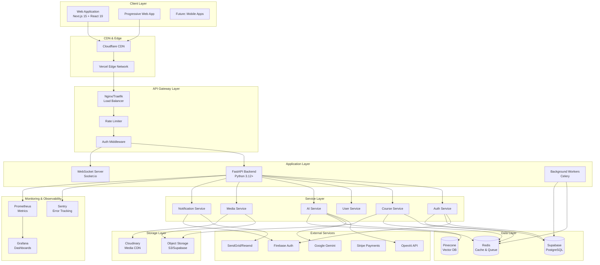

# 🏛️ Technical Architecture - LearnForge AI

## 📋 Document Overview

This document outlines the complete technical architecture for LearnForge AI, including system design, component interactions, data flow, and infrastructure decisions.

---

## 🎯 Architecture Principles

### Core Principles
1. **Scalability**: Designed to handle 100K+ concurrent users
2. **Modularity**: Loosely coupled, highly cohesive components
3. **Performance**: Sub-2-second page loads, optimized API responses
4. **Security**: Zero-trust architecture with defense in depth
5. **Reliability**: 99.9% uptime with graceful degradation
6. **Maintainability**: Clean code, comprehensive documentation

### Design Patterns
- **Microservices-inspired**: Modular backend services
- **API-first**: RESTful + GraphQL hybrid approach
- **Event-driven**: Asynchronous processing for heavy operations
- **CQRS**: Command Query Responsibility Segregation for complex operations
- **Repository Pattern**: Data access abstraction
- **Factory Pattern**: Dynamic object creation (AI providers, storage adapters)

---

## 🏗️ System Architecture Overview



---

## 🎨 Frontend Architecture

### Next.js Application Structure

```
client/
├── app/                          # App Router (Next.js 15)
│   ├── (auth)/                  # Auth routes group
│   │   ├── login/
│   │   ├── register/
│   │   └── layout.tsx
│   ├── (dashboard)/             # Protected routes
│   │   ├── dashboard/
│   │   ├── courses/
│   │   ├── ai-tutor/
│   │   └── layout.tsx
│   ├── (marketing)/             # Public routes
│   │   ├── page.tsx
│   │   ├── about/
│   │   └── pricing/
│   ├── api/                     # API routes
│   │   ├── auth/
│   │   └── webhooks/
│   ├── layout.tsx               # Root layout
│   └── globals.css
│
├── components/
│   ├── ui/                      # Shadcn components
│   ├── features/                # Feature-specific
│   │   ├── courses/
│   │   ├── ai-tutor/
│   │   └── dashboard/
│   ├── layouts/                 # Layout components
│   └── shared/                  # Shared components
│
├── lib/
│   ├── api/                     # API client
│   ├── auth/                    # Auth utilities
│   ├── utils/                   # Helper functions
│   └── constants/               # App constants
│
├── hooks/
│   ├── useAuth.ts
│   ├── useCourses.ts
│   ├── useAI.ts
│   └── index.ts
│
├── store/                        # Zustand stores
│   ├── authStore.ts
│   ├── uiStore.ts
│   └── index.ts
│
├── types/
│   ├── api.ts
│   ├── models.ts
│   └── index.ts
│
└── config/
    ├── site.ts
    └── navigation.ts
```

### Frontend Technologies Deep Dive

#### 1. **Rendering Strategy**
- **Static Generation (SSG)**: Marketing pages, blogs
- **Server-Side Rendering (SSR)**: Dynamic course pages, dashboards
- **Client-Side Rendering (CSR)**: Interactive components (AI chat, code editor)
- **Incremental Static Regeneration (ISR)**: Course catalog, pricing

#### 2. **State Management Strategy**

```typescript
// Server State: TanStack Query
const { data, isLoading } = useQuery({
  queryKey: ['courses', userId],
  queryFn: () => coursesApi.getMyCourses(userId),
  staleTime: 5 * 60 * 1000, // 5 minutes
})

// Client State: Zustand
const useUIStore = create<UIState>((set) => ({
  sidebarOpen: true,
  theme: 'dark',
  toggleSidebar: () => set((state) => ({ sidebarOpen: !state.sidebarOpen })),
}))

// Form State: React Hook Form
const { register, handleSubmit, formState } = useForm<FormData>({
  resolver: zodResolver(schema),
})
```

#### 3. **Performance Optimization**
- **Code Splitting**: Route-based and component-based
- **Image Optimization**: Next.js Image component with Cloudinary
- **Font Optimization**: Variable fonts, subset loading
- **Bundle Analysis**: Regular bundle size monitoring
- **Lazy Loading**: Below-the-fold content
- **Prefetching**: Critical routes and resources

#### 4. **Real-time Features**
```typescript
// Socket.io client setup
import { io } from 'socket.io-client'

const socket = io(process.env.NEXT_PUBLIC_WS_URL, {
  auth: { token: getAuthToken() },
  transports: ['websocket', 'polling'],
})

// Subscribe to real-time updates
socket.on('course:progress_update', (data) => {
  queryClient.setQueryData(['course', data.courseId], data)
})
```

---

## ⚙️ Backend Architecture

### FastAPI Application Structure

```
server/
├── app/
│   ├── main.py                  # FastAPI app initialization
│   ├── __init__.py
│   │
│   ├── api/                     # API endpoints
│   │   ├── v1/
│   │   │   ├── __init__.py
│   │   │   ├── router.py        # Main router
│   │   │   ├── auth.py
│   │   │   ├── users.py
│   │   │   ├── courses.py
│   │   │   ├── ai.py
│   │   │   ├── assessments.py
│   │   │   └── admin.py
│   │   └── deps.py              # Dependencies
│   │
│   ├── core/                    # Core configuration
│   │   ├── config.py            # Settings
│   │   ├── security.py          # Security utils
│   │   ├── database.py          # DB connection
│   │   ├── cache.py             # Redis setup
│   │   └── logging.py           # Logging config
│   │
│   ├── models/                  # SQLAlchemy models
│   │   ├── __init__.py
│   │   ├── user.py
│   │   ├── course.py
│   │   ├── enrollment.py
│   │   ├── assessment.py
│   │   └── progress.py
│   │
│   ├── schemas/                 # Pydantic schemas
│   │   ├── __init__.py
│   │   ├── user.py
│   │   ├── course.py
│   │   ├── assessment.py
│   │   └── common.py
│   │
│   ├── services/                # Business logic
│   │   ├── __init__.py
│   │   ├── auth_service.py
│   │   ├── course_service.py
│   │   ├── ai_service.py
│   │   ├── media_service.py
│   │   └── notification_service.py
│   │
│   ├── repositories/            # Data access
│   │   ├── __init__.py
│   │   ├── base.py
│   │   ├── user_repo.py
│   │   └── course_repo.py
│   │
│   ├── utils/                   # Utilities
│   │   ├── __init__.py
│   │   ├── helpers.py
│   │   ├── validators.py
│   │   └── decorators.py
│   │
│   ├── workers/                 # Celery tasks
│   │   ├── __init__.py
│   │   ├── ai_tasks.py
│   │   ├── email_tasks.py
│   │   └── analytics_tasks.py
│   │
│   └── middleware/              # Custom middleware
│       ├── __init__.py
│       ├── auth_middleware.py
│       ├── cors_middleware.py
│       └── rate_limit.py
│
├── tests/
│   ├── conftest.py
│   ├── test_api/
│   ├── test_services/
│   └── test_utils/
│
├── alembic/                     # DB migrations
│   ├── versions/
│   └── env.py
│
├── scripts/
│   ├── seed_db.py
│   └── migrate.py
│
├── requirements.txt
├── pyproject.toml
└── Dockerfile
```

### Backend Technologies Deep Dive

#### 1. **API Design Patterns**

```python
# Layered Architecture Example

# 1. API Layer (Endpoint)
@router.post("/courses", response_model=CourseResponse)
async def create_course(
    course_data: CourseCreate,
    current_user: User = Depends(get_current_user),
    course_service: CourseService = Depends(get_course_service)
):
    return await course_service.create_course(course_data, current_user.id)

# 2. Service Layer (Business Logic)
class CourseService:
    def __init__(self, course_repo: CourseRepository, ai_service: AIService):
        self.course_repo = course_repo
        self.ai_service = ai_service
    
    async def create_course(self, course_data: CourseCreate, user_id: int):
        # Business logic
        course = await self.course_repo.create(course_data, user_id)
        
        # Generate AI-powered course outline
        outline = await self.ai_service.generate_course_outline(course.title)
        await self.course_repo.update_outline(course.id, outline)
        
        return course

# 3. Repository Layer (Data Access)
class CourseRepository:
    def __init__(self, db: Session):
        self.db = db
    
    async def create(self, course_data: CourseCreate, user_id: int):
        course = Course(**course_data.dict(), instructor_id=user_id)
        self.db.add(course)
        await self.db.commit()
        await self.db.refresh(course)
        return course
```

#### 2. **Authentication & Authorization Flow**

```python
# JWT Token Strategy
from jose import JWTError, jwt
from datetime import datetime, timedelta

def create_access_token(data: dict, expires_delta: timedelta = None):
    to_encode = data.copy()
    expire = datetime.utcnow() + (expires_delta or timedelta(minutes=15))
    to_encode.update({"exp": expire})
    return jwt.encode(to_encode, SECRET_KEY, algorithm=ALGORITHM)

# Firebase Integration
from firebase_admin import auth

async def verify_firebase_token(token: str) -> dict:
    try:
        decoded_token = auth.verify_id_token(token)
        return decoded_token
    except Exception as e:
        raise HTTPException(status_code=401, detail="Invalid authentication")

# Combined Auth Strategy
async def get_current_user(
    authorization: str = Header(None),
    db: Session = Depends(get_db)
) -> User:
    # Try JWT first
    if authorization and authorization.startswith("Bearer "):
        token = authorization.split(" ")[1]
        try:
            payload = jwt.decode(token, SECRET_KEY, algorithms=[ALGORITHM])
            user_id = payload.get("sub")
        except JWTError:
            # Fallback to Firebase
            firebase_data = await verify_firebase_token(token)
            user_id = firebase_data.get("uid")
    
    user = await get_user_by_id(db, user_id)
    if not user:
        raise HTTPException(status_code=401, detail="User not found")
    return user
```

#### 3. **Caching Strategy**

```python
# Multi-layer caching
from functools import wraps
import json

async def cached(ttl: int = 300):
    """Decorator for caching function results in Redis"""
    def decorator(func):
        @wraps(func)
        async def wrapper(*args, **kwargs):
            # Generate cache key
            cache_key = f"{func.__name__}:{hash(str(args) + str(kwargs))}"
            
            # Try to get from cache
            cached_data = await redis.get(cache_key)
            if cached_data:
                return json.loads(cached_data)
            
            # Execute function
            result = await func(*args, **kwargs)
            
            # Store in cache
            await redis.setex(cache_key, ttl, json.dumps(result))
            return result
        return wrapper
    return decorator

# Usage
@cached(ttl=600)  # Cache for 10 minutes
async def get_course_details(course_id: int):
    return await course_repo.get_by_id(course_id)
```

#### 4. **Background Job Processing**

```python
# Celery configuration
from celery import Celery

celery_app = Celery(
    "learnforge",
    broker="redis://localhost:6379/0",
    backend="redis://localhost:6379/0"
)

# Tasks
@celery_app.task(bind=True, max_retries=3)
def generate_course_certificate(self, user_id: int, course_id: int):
    try:
        # Generate certificate PDF
        certificate_url = create_certificate(user_id, course_id)
        
        # Send email notification
        send_certificate_email(user_id, certificate_url)
        
        return {"status": "success", "url": certificate_url}
    except Exception as e:
        # Retry with exponential backoff
        raise self.retry(exc=e, countdown=2 ** self.request.retries)
```

---

## 🔌 API Strategy

### RESTful API Design

**Base URL**: `https://api.learnforge.ai/v1`

**API Versioning**: URL-based (`/v1`, `/v2`)

**Response Format**: JSON

```json
{
  "success": true,
  "data": { },
  "meta": {
    "pagination": {
      "page": 1,
      "per_page": 20,
      "total": 150
    }
  },
  "errors": []
}
```

### WebSocket Strategy

**Real-time Events**:
- Course progress updates
- Live chat messages
- Notification broadcasts
- Collaborative editing
- Live class interactions

```typescript
// WebSocket namespaces
/classroom/:roomId     // Live classroom
/chat/:userId          // Direct messaging
/notifications/:userId // User notifications
/collaboration/:docId  // Collaborative editing
```

---

## 🗄️ Database Architecture

### Primary Database: Supabase (PostgreSQL)

**Features Used**:
- Row Level Security (RLS)
- Real-time subscriptions
- Built-in Auth
- Storage for media
- Auto-generated REST API

### Caching: Redis

**Use Cases**:
- Session storage
- API response caching
- Rate limiting counters
- Real-time leaderboards
- Celery message broker

### Vector Database: Pinecone

**Use Cases**:
- Semantic search across courses
- Similar content recommendations
- RAG (Retrieval Augmented Generation) for AI tutor
- Plagiarism detection

---

## 🤖 AI/ML Architecture

### Multi-Provider Strategy

```python
class AIProviderFactory:
    @staticmethod
    def get_provider(task_type: str):
        if task_type == "chat":
            return OpenAIProvider(model="gpt-4-turbo")
        elif task_type == "fast_generation":
            return GeminiProvider(model="gemini-2.0-flash")
        elif task_type == "code":
            return OpenAIProvider(model="gpt-4")
        else:
            return DefaultProvider()
```

### RAG Implementation

```python
from langchain.chains import RetrievalQA
from langchain.vectorstores import Pinecone

# Index course content
vectorstore = Pinecone.from_documents(
    course_documents,
    embeddings,
    index_name="course-content"
)

# AI Tutor with context
qa_chain = RetrievalQA.from_chain_type(
    llm=llm,
    chain_type="stuff",
    retriever=vectorstore.as_retriever()
)

response = qa_chain.run(student_question)
```

---

## 📊 Monitoring & Observability

### Metrics Collection

- **Application Metrics**: Request rate, latency, error rate
- **Business Metrics**: User engagement, course completions, revenue
- **Infrastructure Metrics**: CPU, memory, disk, network

### Error Tracking

```python
import sentry_sdk

sentry_sdk.init(
    dsn=SENTRY_DSN,
    environment="production",
    traces_sample_rate=0.1,
    profiles_sample_rate=0.1,
)
```

### Logging Strategy

```python
from loguru import logger

logger.add(
    "logs/app_{time}.log",
    rotation="500 MB",
    retention="10 days",
    level="INFO"
)
```

---

## 🔒 Security Architecture

### Security Layers

1. **Network Security**
   - DDoS protection (Cloudflare)
   - WAF rules
   - Rate limiting

2. **Application Security**
   - Input validation
   - CSRF protection
   - XSS prevention
   - SQL injection prevention (ORM)

3. **Data Security**
   - Encryption at rest
   - Encryption in transit (TLS 1.3)
   - Field-level encryption for sensitive data

4. **Authentication Security**
   - Multi-factor authentication
   - Password policies
   - Session management
   - Token rotation

---

## 🚀 Deployment Architecture

### Frontend: Vercel

- Automatic deployments from Git
- Edge network distribution
- Preview deployments for PRs
- Analytics and Web Vitals

### Backend: Railway/Render

- Docker container deployment
- Auto-scaling
- Health checks
- Zero-downtime deployments

### Database: Supabase Cloud

- Managed PostgreSQL
- Automatic backups
- Point-in-time recovery
- Replication

---

## 📈 Scalability Strategy

### Horizontal Scaling

- **API Servers**: Load-balanced FastAPI instances
- **Background Workers**: Multiple Celery workers
- **Database**: Read replicas for queries

### Vertical Scaling

- Upgrade server resources as needed
- Database connection pooling
- Optimize queries and indexes

### Caching Layers

1. **Browser Cache**: Static assets
2. **CDN Cache**: Images, videos
3. **Redis Cache**: API responses, sessions
4. **Database Query Cache**: Frequent queries

---

**Document Version**: 1.0  
**Last Updated**: January 8, 2026  
**Status**: Draft
