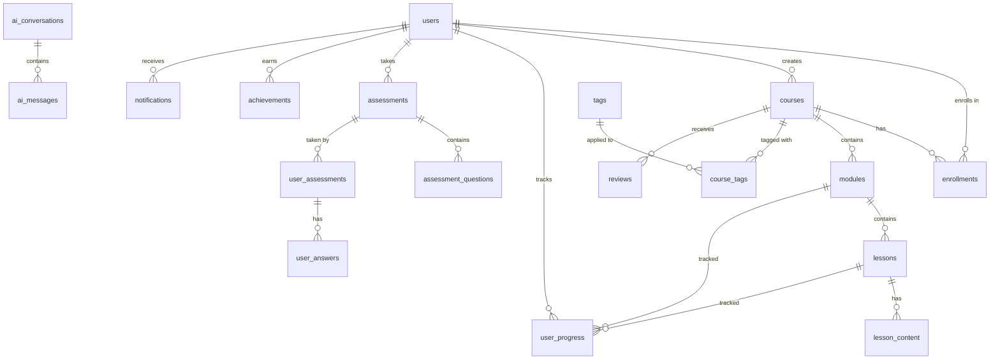

# 🗄️ Database Schema Design - LearnForge AI

## 📋 Document Overview

This document defines the complete database schema for LearnForge AI using PostgreSQL (Supabase) with Row Level Security (RLS), relationships, indexes, and constraints.

---

## 🎯 Database Design Principles

1. **Normalization**: 3NF (Third Normal Form) for most tables
2. **Performance**: Strategic denormalization where needed
3. **Security**: Row Level Security for all tables
4. **Scalability**: Partitioning for large tables (analytics, logs)
5. **Integrity**: Foreign key constraints and check constraints
6. **Audit**: Created/updated timestamps on all tables

---

## 📊 Entity Relationship Overview



---

## 📝 Core Tables

### 1. Users Table

```sql
CREATE TABLE users (
    id UUID PRIMARY KEY DEFAULT gen_random_uuid(),
    
    -- Authentication
    firebase_uid VARCHAR(128) UNIQUE,
    email VARCHAR(255) UNIQUE NOT NULL,
    email_verified BOOLEAN DEFAULT FALSE,
    phone_number VARCHAR(20),
    phone_verified BOOLEAN DEFAULT FALSE,
    
    -- Profile
    full_name VARCHAR(255) NOT NULL,
    display_name VARCHAR(100),
    avatar_url TEXT,
    bio TEXT,
    date_of_birth DATE,
    
    -- Role & Status
    role VARCHAR(20) NOT NULL DEFAULT 'student' CHECK (role IN ('student', 'instructor', 'admin', 'moderator')),
    account_status VARCHAR(20) DEFAULT 'active' CHECK (account_status IN ('active', 'suspended', 'inactive', 'deleted')),
    
    -- Subscription
    subscription_tier VARCHAR(20) DEFAULT 'free' CHECK (subscription_tier IN ('free', 'basic', 'premium', 'enterprise')),
    subscription_expires_at TIMESTAMP WITH TIME ZONE,
    
    -- Preferences
    language VARCHAR(10) DEFAULT 'en',
    timezone VARCHAR(50) DEFAULT 'UTC',
    theme VARCHAR(20) DEFAULT 'system' CHECK (theme IN ('light', 'dark', 'system')),
    email_notifications BOOLEAN DEFAULT TRUE,
    push_notifications BOOLEAN DEFAULT TRUE,
    
    -- Gamification
    total_xp INTEGER DEFAULT 0,
    current_level INTEGER DEFAULT 1,
    streak_days INTEGER DEFAULT 0,
    longest_streak INTEGER DEFAULT 0,
    last_activity_date DATE,
    
    -- Metadata
    last_login_at TIMESTAMP WITH TIME ZONE,
    last_login_ip INET,
    created_at TIMESTAMP WITH TIME ZONE DEFAULT NOW(),
    updated_at TIMESTAMP WITH TIME ZONE DEFAULT NOW(),
    deleted_at TIMESTAMP WITH TIME ZONE,
    
    -- Constraints
    CONSTRAINT valid_email CHECK (email ~* '^[A-Za-z0-9._%+-]+@[A-Za-z0-9.-]+\.[A-Za-z]{2,}$')
);

-- Indexes
CREATE INDEX idx_users_email ON users(email);
CREATE INDEX idx_users_firebase_uid ON users(firebase_uid);
CREATE INDEX idx_users_role ON users(role);
CREATE INDEX idx_users_created_at ON users(created_at);

-- Updated at trigger
CREATE TRIGGER update_users_updated_at
    BEFORE UPDATE ON users
    FOR EACH ROW
    EXECUTE FUNCTION update_updated_at_column();
```

### 2. Courses Table

```sql
CREATE TABLE courses (
    id UUID PRIMARY KEY DEFAULT gen_random_uuid(),
    
    -- Basic Info
    title VARCHAR(255) NOT NULL,
    slug VARCHAR(255) UNIQUE NOT NULL,
    description TEXT,
    short_description VARCHAR(500),
    
    -- Instructor
    instructor_id UUID NOT NULL REFERENCES users(id) ON DELETE CASCADE,
    
    -- Content
    thumbnail_url TEXT,
    trailer_video_url TEXT,
    learning_objectives JSONB DEFAULT '[]',
    prerequisites JSONB DEFAULT '[]',
    
    -- Categorization
    category VARCHAR(100),
    subcategory VARCHAR(100),
    difficulty_level VARCHAR(20) CHECK (difficulty_level IN ('beginner', 'intermediate', 'advanced', 'expert')),
    
    -- Pricing
    is_free BOOLEAN DEFAULT TRUE,
    price DECIMAL(10, 2) DEFAULT 0,
    currency VARCHAR(3) DEFAULT 'USD',
    discount_price DECIMAL(10, 2),
    discount_expires_at TIMESTAMP WITH TIME ZONE,
    
    -- Status & Publishing
    status VARCHAR(20) DEFAULT 'draft' CHECK (status IN ('draft', 'review', 'published', 'archived')),
    published_at TIMESTAMP WITH TIME ZONE,
    
    -- Metrics
    total_enrollments INTEGER DEFAULT 0,
    total_completions INTEGER DEFAULT 0,
    average_rating DECIMAL(3, 2) DEFAULT 0,
    total_reviews INTEGER DEFAULT 0,
    total_duration_minutes INTEGER DEFAULT 0,
    
    -- SEO
    meta_title VARCHAR(255),
    meta_description TEXT,
    keywords JSONB DEFAULT '[]',
    
    -- Features
    has_certificate BOOLEAN DEFAULT TRUE,
    has_lifetime_access BOOLEAN DEFAULT TRUE,
    has_downloadable_resources BOOLEAN DEFAULT FALSE,
    
    -- Metadata
    created_at TIMESTAMP WITH TIME ZONE DEFAULT NOW(),
    updated_at TIMESTAMP WITH TIME ZONE DEFAULT NOW(),
    deleted_at TIMESTAMP WITH TIME ZONE
);

-- Indexes
CREATE INDEX idx_courses_slug ON courses(slug);
CREATE INDEX idx_courses_instructor_id ON courses(instructor_id);
CREATE INDEX idx_courses_category ON courses(category);
CREATE INDEX idx_courses_status ON courses(status);
CREATE INDEX idx_courses_published_at ON courses(published_at);
CREATE INDEX idx_courses_difficulty ON courses(difficulty_level);

-- Full-text search
CREATE INDEX idx_courses_search ON courses USING GIN(to_tsvector('english', title || ' ' || COALESCE(description, '')));
```

### 3. Modules Table

```sql
CREATE TABLE modules (
    id UUID PRIMARY KEY DEFAULT gen_random_uuid(),
    course_id UUID NOT NULL REFERENCES courses(id) ON DELETE CASCADE,
    
    title VARCHAR(255) NOT NULL,
    description TEXT,
    order_index INTEGER NOT NULL,
    
    duration_minutes INTEGER DEFAULT 0,
    is_published BOOLEAN DEFAULT FALSE,
    
    created_at TIMESTAMP WITH TIME ZONE DEFAULT NOW(),
    updated_at TIMESTAMP WITH TIME ZONE DEFAULT NOW(),
    
    UNIQUE(course_id, order_index)
);

CREATE INDEX idx_modules_course_id ON modules(course_id);
CREATE INDEX idx_modules_order ON modules(course_id, order_index);
```

### 4. Lessons Table

```sql
CREATE TABLE lessons (
    id UUID PRIMARY KEY DEFAULT gen_random_uuid(),
    module_id UUID NOT NULL REFERENCES modules(id) ON DELETE CASCADE,
    
    title VARCHAR(255) NOT NULL,
    description TEXT,
    order_index INTEGER NOT NULL,
    
    -- Content Type
    lesson_type VARCHAR(20) NOT NULL CHECK (lesson_type IN ('video', 'article', 'quiz', 'assignment', 'interactive', 'live_session')),
    
    -- Duration
    duration_minutes INTEGER DEFAULT 0,
    
    -- Content
    content JSONB, -- Flexible content storage
    video_url TEXT,
    article_content TEXT,
    
    -- Resources
    downloadable_resources JSONB DEFAULT '[]',
    
    -- Settings
    is_preview BOOLEAN DEFAULT FALSE, -- Free preview
    is_mandatory BOOLEAN DEFAULT TRUE,
    is_published BOOLEAN DEFAULT FALSE,
    
    created_at TIMESTAMP WITH TIME ZONE DEFAULT NOW(),
    updated_at TIMESTAMP WITH TIME ZONE DEFAULT NOW(),
    
    UNIQUE(module_id, order_index)
);

CREATE INDEX idx_lessons_module_id ON lessons(module_id);
CREATE INDEX idx_lessons_order ON lessons(module_id, order_index);
CREATE INDEX idx_lessons_type ON lessons(lesson_type);
```

### 5. Enrollments Table

```sql
CREATE TABLE enrollments (
    id UUID PRIMARY KEY DEFAULT gen_random_uuid(),
    user_id UUID NOT NULL REFERENCES users(id) ON DELETE CASCADE,
    course_id UUID NOT NULL REFERENCES courses(id) ON DELETE CASCADE,
    
    -- Enrollment details
    enrolled_at TIMESTAMP WITH TIME ZONE DEFAULT NOW(),
    started_at TIMESTAMP WITH TIME ZONE,
    completed_at TIMESTAMP WITH TIME ZONE,
    
    -- Progress
    progress_percentage DECIMAL(5, 2) DEFAULT 0 CHECK (progress_percentage >= 0 AND progress_percentage <= 100),
    completed_lessons INTEGER DEFAULT 0,
    total_lessons INTEGER DEFAULT 0,
    
    -- Time tracking
    total_time_spent_minutes INTEGER DEFAULT 0,
    last_accessed_at TIMESTAMP WITH TIME ZONE,
    last_accessed_lesson_id UUID REFERENCES lessons(id),
    
    -- Status
    status VARCHAR(20) DEFAULT 'active' CHECK (status IN ('active', 'completed', 'expired', 'dropped')),
    
    -- Payment (if applicable)
    payment_id VARCHAR(255),
    payment_amount DECIMAL(10, 2),
    payment_currency VARCHAR(3),
    
    -- Certificate
    certificate_issued BOOLEAN DEFAULT FALSE,
    certificate_url TEXT,
    certificate_issued_at TIMESTAMP WITH TIME ZONE,
    
    created_at TIMESTAMP WITH TIME ZONE DEFAULT NOW(),
    updated_at TIMESTAMP WITH TIME ZONE DEFAULT NOW(),
    
    UNIQUE(user_id, course_id)
);

CREATE INDEX idx_enrollments_user_id ON enrollments(user_id);
CREATE INDEX idx_enrollments_course_id ON enrollments(course_id);
CREATE INDEX idx_enrollments_status ON enrollments(status);
CREATE INDEX idx_enrollments_completed_at ON enrollments(completed_at);
```

### 6. User Progress Table

```sql
CREATE TABLE user_progress (
    id UUID PRIMARY KEY DEFAULT gen_random_uuid(),
    user_id UUID NOT NULL REFERENCES users(id) ON DELETE CASCADE,
    enrollment_id UUID NOT NULL REFERENCES enrollments(id) ON DELETE CASCADE,
    lesson_id UUID NOT NULL REFERENCES lessons(id) ON DELETE CASCADE,
    
    -- Progress
    status VARCHAR(20) DEFAULT 'not_started' CHECK (status IN ('not_started', 'in_progress', 'completed')),
    progress_percentage DECIMAL(5, 2) DEFAULT 0,
    
    -- Time tracking
    time_spent_seconds INTEGER DEFAULT 0,
    last_position_seconds INTEGER DEFAULT 0, -- For videos
    
    -- Completion
    completed_at TIMESTAMP WITH TIME ZONE,
    
    -- Attempts
    attempts_count INTEGER DEFAULT 0,
    
    created_at TIMESTAMP WITH TIME ZONE DEFAULT NOW(),
    updated_at TIMESTAMP WITH TIME ZONE DEFAULT NOW(),
    
    UNIQUE(user_id, lesson_id)
);

CREATE INDEX idx_user_progress_user_id ON user_progress(user_id);
CREATE INDEX idx_user_progress_lesson_id ON user_progress(lesson_id);
CREATE INDEX idx_user_progress_enrollment_id ON user_progress(enrollment_id);
```

---

## 🎯 Assessment Tables

### 7. Assessments Table

```sql
CREATE TABLE assessments (
    id UUID PRIMARY KEY DEFAULT gen_random_uuid(),
    
    -- Association
    course_id UUID REFERENCES courses(id) ON DELETE CASCADE,
    lesson_id UUID REFERENCES lessons(id) ON DELETE CASCADE,
    created_by UUID NOT NULL REFERENCES users(id),
    
    -- Basic Info
    title VARCHAR(255) NOT NULL,
    description TEXT,
    instructions TEXT,
    
    -- Type & Settings
    assessment_type VARCHAR(20) NOT NULL CHECK (assessment_type IN ('quiz', 'exam', 'assignment', 'practice')),
    difficulty_level VARCHAR(20) CHECK (difficulty_level IN ('easy', 'medium', 'hard')),
    
    -- Timing
    time_limit_minutes INTEGER,
    
    -- Scoring
    total_points INTEGER DEFAULT 0,
    passing_percentage DECIMAL(5, 2) DEFAULT 70,
    
    -- Attempts
    max_attempts INTEGER DEFAULT 1,
    allow_review BOOLEAN DEFAULT TRUE,
    show_correct_answers BOOLEAN DEFAULT TRUE,
    
    -- Randomization
    randomize_questions BOOLEAN DEFAULT FALSE,
    randomize_options BOOLEAN DEFAULT FALSE,
    
    -- Scheduling
    available_from TIMESTAMP WITH TIME ZONE,
    available_until TIMESTAMP WITH TIME ZONE,
    
    -- Status
    is_published BOOLEAN DEFAULT FALSE,
    
    created_at TIMESTAMP WITH TIME ZONE DEFAULT NOW(),
    updated_at TIMESTAMP WITH TIME ZONE DEFAULT NOW()
);

CREATE INDEX idx_assessments_course_id ON assessments(course_id);
CREATE INDEX idx_assessments_lesson_id ON assessments(lesson_id);
CREATE INDEX idx_assessments_type ON assessments(assessment_type);
```

### 8. Assessment Questions Table

```sql
CREATE TABLE assessment_questions (
    id UUID PRIMARY KEY DEFAULT gen_random_uuid(),
    assessment_id UUID NOT NULL REFERENCES assessments(id) ON DELETE CASCADE,
    
    -- Question
    question_text TEXT NOT NULL,
    question_type VARCHAR(20) NOT NULL CHECK (question_type IN ('multiple_choice', 'true_false', 'short_answer', 'essay', 'code')),
    
    -- Options (for multiple choice)
    options JSONB DEFAULT '[]', -- [{text: string, is_correct: boolean}]
    
    -- Correct Answer
    correct_answer TEXT,
    
    -- Scoring
    points INTEGER DEFAULT 1,
    order_index INTEGER NOT NULL,
    
    -- Metadata
    explanation TEXT,
    hint TEXT,
    
    created_at TIMESTAMP WITH TIME ZONE DEFAULT NOW(),
    updated_at TIMESTAMP WITH TIME ZONE DEFAULT NOW()
);

CREATE INDEX idx_assessment_questions_assessment_id ON assessment_questions(assessment_id);
```

### 9. User Assessments Table

```sql
CREATE TABLE user_assessments (
    id UUID PRIMARY KEY DEFAULT gen_random_uuid(),
    user_id UUID NOT NULL REFERENCES users(id) ON DELETE CASCADE,
    assessment_id UUID NOT NULL REFERENCES assessments(id) ON DELETE CASCADE,
    enrollment_id UUID REFERENCES enrollments(id) ON DELETE CASCADE,
    
    -- Attempt
    attempt_number INTEGER DEFAULT 1,
    
    -- Timing
    started_at TIMESTAMP WITH TIME ZONE DEFAULT NOW(),
    submitted_at TIMESTAMP WITH TIME ZONE,
    time_taken_seconds INTEGER,
    
    -- Scoring
    total_points_possible INTEGER NOT NULL,
    points_earned DECIMAL(10, 2) DEFAULT 0,
    percentage_score DECIMAL(5, 2),
    
    -- Status
    status VARCHAR(20) DEFAULT 'in_progress' CHECK (status IN ('in_progress', 'submitted', 'graded', 'expired')),
    passed BOOLEAN,
    
    -- Grading
    graded_by UUID REFERENCES users(id),
    graded_at TIMESTAMP WITH TIME ZONE,
    feedback TEXT,
    
    created_at TIMESTAMP WITH TIME ZONE DEFAULT NOW(),
    updated_at TIMESTAMP WITH TIME ZONE DEFAULT NOW()
);

CREATE INDEX idx_user_assessments_user_id ON user_assessments(user_id);
CREATE INDEX idx_user_assessments_assessment_id ON user_assessments(assessment_id);
CREATE INDEX idx_user_assessments_status ON user_assessments(status);
```

### 10. User Answers Table

```sql
CREATE TABLE user_answers (
    id UUID PRIMARY KEY DEFAULT gen_random_uuid(),
    user_assessment_id UUID NOT NULL REFERENCES user_assessments(id) ON DELETE CASCADE,
    question_id UUID NOT NULL REFERENCES assessment_questions(id) ON DELETE CASCADE,
    
    -- Answer
    answer_text TEXT,
    selected_option_id INTEGER,
    
    -- Evaluation
    is_correct BOOLEAN,
    points_awarded DECIMAL(10, 2) DEFAULT 0,
    
    -- Feedback
    feedback TEXT,
    
    created_at TIMESTAMP WITH TIME ZONE DEFAULT NOW(),
    updated_at TIMESTAMP WITH TIME ZONE DEFAULT NOW(),
    
    UNIQUE(user_assessment_id, question_id)
);

CREATE INDEX idx_user_answers_user_assessment_id ON user_answers(user_assessment_id);
```

---

## 🤖 AI Tables

### 11. AI Conversations Table

```sql
CREATE TABLE ai_conversations (
    id UUID PRIMARY KEY DEFAULT gen_random_uuid(),
    user_id UUID NOT NULL REFERENCES users(id) ON DELETE CASCADE,
    
    -- Context
    course_id UUID REFERENCES courses(id),
    lesson_id UUID REFERENCES lessons(id),
    
    -- Conversation
    title VARCHAR(255),
    conversation_type VARCHAR(20) DEFAULT 'general' CHECK (conversation_type IN ('general', 'course_help', 'code_debug', 'essay_review', 'career')),
    
    -- Metrics
    total_messages INTEGER DEFAULT 0,
    total_tokens_used INTEGER DEFAULT 0,
    
    -- Status
    is_archived BOOLEAN DEFAULT FALSE,
    
    created_at TIMESTAMP WITH TIME ZONE DEFAULT NOW(),
    updated_at TIMESTAMP WITH TIME ZONE DEFAULT NOW()
);

CREATE INDEX idx_ai_conversations_user_id ON ai_conversations(user_id);
CREATE INDEX idx_ai_conversations_course_id ON ai_conversations(course_id);
```

### 12. AI Messages Table

```sql
CREATE TABLE ai_messages (
    id UUID PRIMARY KEY DEFAULT gen_random_uuid(),
    conversation_id UUID NOT NULL REFERENCES ai_conversations(id) ON DELETE CASCADE,
    
    -- Message
    role VARCHAR(20) NOT NULL CHECK (role IN ('user', 'assistant', 'system')),
    content TEXT NOT NULL,
    
    -- Metadata
    tokens_used INTEGER,
    model_used VARCHAR(50),
    processing_time_ms INTEGER,
    
    -- Feedback
    user_rating INTEGER CHECK (user_rating >= 1 AND user_rating <= 5),
    user_feedback TEXT,
    
    created_at TIMESTAMP WITH TIME ZONE DEFAULT NOW()
);

CREATE INDEX idx_ai_messages_conversation_id ON ai_messages(conversation_id);
CREATE INDEX idx_ai_messages_created_at ON ai_messages(created_at);
```

---

## 🎮 Gamification Tables

### 13. Achievements Table

```sql
CREATE TABLE achievements (
    id UUID PRIMARY KEY DEFAULT gen_random_uuid(),
    
    -- Achievement Info
    name VARCHAR(255) NOT NULL,
    description TEXT,
    icon_url TEXT,
    
    -- Type & Criteria
    achievement_type VARCHAR(50) NOT NULL,
    criteria JSONB NOT NULL, -- {type: 'course_completion', count: 5}
    
    -- Reward
    xp_reward INTEGER DEFAULT 0,
    badge_tier VARCHAR(20) CHECK (badge_tier IN ('bronze', 'silver', 'gold', 'platinum')),
    
    -- Availability
    is_active BOOLEAN DEFAULT TRUE,
    
    created_at TIMESTAMP WITH TIME ZONE DEFAULT NOW()
);

CREATE INDEX idx_achievements_type ON achievements(achievement_type);
```

### 14. User Achievements Table

```sql
CREATE TABLE user_achievements (
    id UUID PRIMARY KEY DEFAULT gen_random_uuid(),
    user_id UUID NOT NULL REFERENCES users(id) ON DELETE CASCADE,
    achievement_id UUID NOT NULL REFERENCES achievements(id) ON DELETE CASCADE,
    
    earned_at TIMESTAMP WITH TIME ZONE DEFAULT NOW(),
    progress_data JSONB,
    
    UNIQUE(user_id, achievement_id)
);

CREATE INDEX idx_user_achievements_user_id ON user_achievements(user_id);
```

---

## 📊 Additional Tables

### 15. Reviews Table

```sql
CREATE TABLE reviews (
    id UUID PRIMARY KEY DEFAULT gen_random_uuid(),
    course_id UUID NOT NULL REFERENCES courses(id) ON DELETE CASCADE,
    user_id UUID NOT NULL REFERENCES users(id) ON DELETE CASCADE,
    enrollment_id UUID REFERENCES enrollments(id) ON DELETE CASCADE,
    
    -- Review
    rating INTEGER NOT NULL CHECK (rating >= 1 AND rating <= 5),
    title VARCHAR(255),
    comment TEXT,
    
    -- Helpfulness
    helpful_count INTEGER DEFAULT 0,
    unhelpful_count INTEGER DEFAULT 0,
    
    -- Status
    is_verified_purchase BOOLEAN DEFAULT FALSE,
    is_published BOOLEAN DEFAULT TRUE,
    moderation_status VARCHAR(20) DEFAULT 'approved' CHECK (moderation_status IN ('pending', 'approved', 'rejected')),
    
    created_at TIMESTAMP WITH TIME ZONE DEFAULT NOW(),
    updated_at TIMESTAMP WITH TIME ZONE DEFAULT NOW(),
    
    UNIQUE(user_id, course_id)
);

CREATE INDEX idx_reviews_course_id ON reviews(course_id);
CREATE INDEX idx_reviews_user_id ON reviews(user_id);
CREATE INDEX idx_reviews_rating ON reviews(rating);
```

### 16. Notifications Table

```sql
CREATE TABLE notifications (
    id UUID PRIMARY KEY DEFAULT gen_random_uuid(),
    user_id UUID NOT NULL REFERENCES users(id) ON DELETE CASCADE,
    
    -- Notification
    type VARCHAR(50) NOT NULL,
    title VARCHAR(255) NOT NULL,
    message TEXT,
    
    -- Action
    action_url TEXT,
    action_label VARCHAR(100),
    
    -- Status
    is_read BOOLEAN DEFAULT FALSE,
    read_at TIMESTAMP WITH TIME ZONE,
    
    -- Priority
    priority VARCHAR(20) DEFAULT 'normal' CHECK (priority IN ('low', 'normal', 'high', 'urgent')),
    
    created_at TIMESTAMP WITH TIME ZONE DEFAULT NOW()
);

CREATE INDEX idx_notifications_user_id ON notifications(user_id);
CREATE INDEX idx_notifications_is_read ON notifications(user_id, is_read);
CREATE INDEX idx_notifications_created_at ON notifications(created_at);
```

### 17. Tags Table

```sql
CREATE TABLE tags (
    id UUID PRIMARY KEY DEFAULT gen_random_uuid(),
    name VARCHAR(100) UNIQUE NOT NULL,
    slug VARCHAR(100) UNIQUE NOT NULL,
    description TEXT,
    
    usage_count INTEGER DEFAULT 0,
    
    created_at TIMESTAMP WITH TIME ZONE DEFAULT NOW()
);

CREATE INDEX idx_tags_name ON tags(name);
CREATE INDEX idx_tags_slug ON tags(slug);
```

### 18. Course Tags Table

```sql
CREATE TABLE course_tags (
    course_id UUID NOT NULL REFERENCES courses(id) ON DELETE CASCADE,
    tag_id UUID NOT NULL REFERENCES tags(id) ON DELETE CASCADE,
    
    created_at TIMESTAMP WITH TIME ZONE DEFAULT NOW(),
    
    PRIMARY KEY (course_id, tag_id)
);

CREATE INDEX idx_course_tags_course_id ON course_tags(course_id);
CREATE INDEX idx_course_tags_tag_id ON course_tags(tag_id);
```

---

## 🔒 Row Level Security (RLS) Policies

### Users Table

```sql
-- Enable RLS
ALTER TABLE users ENABLE ROW LEVEL SECURITY;

-- Users can read their own data
CREATE POLICY "Users can view own profile" ON users
    FOR SELECT USING (auth.uid() = firebase_uid);

-- Users can update their own data
CREATE POLICY "Users can update own profile" ON users
    FOR UPDATE USING (auth.uid() = firebase_uid);

-- Admins can view all
CREATE POLICY "Admins can view all users" ON users
    FOR ALL USING (
        EXISTS (
            SELECT 1 FROM users
            WHERE firebase_uid = auth.uid() AND role = 'admin'
        )
    );
```

### Courses Table

```sql
ALTER TABLE courses ENABLE ROW LEVEL SECURITY;

-- Anyone can view published courses
CREATE POLICY "Anyone can view published courses" ON courses
    FOR SELECT USING (status = 'published' OR auth.uid() IS NOT NULL);

-- Instructors can manage their own courses
CREATE POLICY "Instructors can manage own courses" ON courses
    FOR ALL USING (
        EXISTS (
            SELECT 1 FROM users
            WHERE id = instructor_id AND firebase_uid = auth.uid()
        )
    );
```

### Enrollments Table

```sql
ALTER TABLE enrollments ENABLE ROW LEVEL SECURITY;

-- Users can view their own enrollments
CREATE POLICY "Users can view own enrollments" ON enrollments
    FOR SELECT USING (
        EXISTS (
            SELECT 1 FROM users
            WHERE id = user_id AND firebase_uid = auth.uid()
        )
    );

-- Users can enroll in courses
CREATE POLICY "Users can enroll in courses" ON enrollments
    FOR INSERT WITH CHECK (
        EXISTS (
            SELECT 1 FROM users
            WHERE id = user_id AND firebase_uid = auth.uid()
        )
    );
```

---

## 📈 Database Functions & Triggers

### Update Modified Timestamp

```sql
CREATE OR REPLACE FUNCTION update_updated_at_column()
RETURNS TRIGGER AS $$
BEGIN
    NEW.updated_at = NOW();
    RETURN NEW;
END;
$$ LANGUAGE plpgsql;

-- Apply to all tables with updated_at
CREATE TRIGGER update_courses_updated_at
    BEFORE UPDATE ON courses
    FOR EACH ROW
    EXECUTE FUNCTION update_updated_at_column();

-- Repeat for other tables...
```

### Update Course Statistics

```sql
CREATE OR REPLACE FUNCTION update_course_stats()
RETURNS TRIGGER AS $$
BEGIN
    -- Update enrollment count
    UPDATE courses
    SET total_enrollments = (
        SELECT COUNT(*) FROM enrollments WHERE course_id = NEW.course_id
    )
    WHERE id = NEW.course_id;
    
    RETURN NEW;
END;
$$ LANGUAGE plpgsql;

CREATE TRIGGER update_course_enrollment_stats
    AFTER INSERT ON enrollments
    FOR EACH ROW
    EXECUTE FUNCTION update_course_stats();
```

---

## 🔍 Useful Views

### Course Overview View

```sql
CREATE OR REPLACE VIEW course_overview AS
SELECT 
    c.id,
    c.title,
    c.slug,
    c.thumbnail_url,
    c.difficulty_level,
    c.price,
    c.average_rating,
    c.total_enrollments,
    c.total_reviews,
    u.full_name as instructor_name,
    u.avatar_url as instructor_avatar,
    COUNT(DISTINCT m.id) as total_modules,
    COUNT(DISTINCT l.id) as total_lessons,
    SUM(l.duration_minutes) as total_duration_minutes
FROM courses c
JOIN users u ON c.instructor_id = u.id
LEFT JOIN modules m ON c.id = m.course_id
LEFT JOIN lessons l ON m.id = l.module_id
WHERE c.status = 'published'
GROUP BY c.id, u.full_name, u.avatar_url;
```

---

**Document Version**: 1.0  
**Last Updated**: January 8, 2026  
**Status**: Draft
